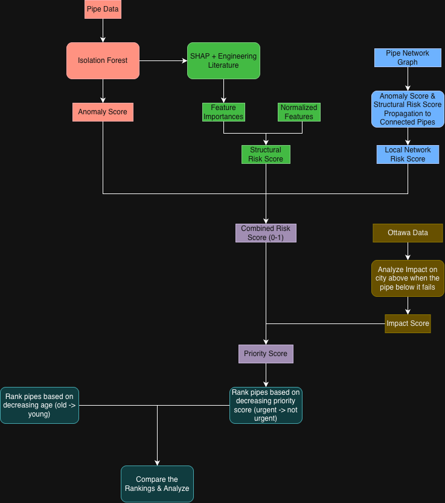

# HydroGraph: An AI-powered Framework for the Risk Assessment of Pipes in Ottawa 💦🛜

## Abstract 🔍
HydroGraph is a data-driven framework that analyzes the risk of pipes across Ottawa
using engineering domain knowledge, machine learning, and network-wide propagation.
This project aims to uncover patterns within Ottawa's water infrastructure network and identify which pipes should be prioritized for inspection, maintenance, or replacement. Traditional asset management
strategies typically use simple signals such as pipe age, potentially ignoring structural anomalies or network-wide influences.
HydroGraph combines unsupervised anomaly detection, engineering-informed structural risk, and graph-based risk propagation
to produce a comprehensive and reliable prioritization framework. The resulting metric aims to support more informed resource allocation
decisions for aging water infrastructure.

## Research Question ❓

This project aims to answer the following question:

> To what extent can an integrated framework combining engineering heuristics, unsupervised anomaly detection, and graph-based risk propagation improve water infrastructure risk assessment and maintenance prioritization compared to traditional age-based asset management?

## Problem ⚠️
- Aging water infrastructure presents a major challenge for cities worldwide. As infrastructure ages, maintenance costs increase. Effective prioritization is therefore critical, yet many asset management strategies rely heavily on simple indicators such as pipe age, which may not fully capture structural condition or network-level risk.
- This particular project will focus on Ottawa, Canada, using publicly available municipal infrastructure datasets to evaluate pipe risk and maintenance prioritization.
- According to [CBC](https://www.cbc.ca/news/canada/water-main-age-health-canada-1.7307124), "About one in every five kilometres of large water mains in Canada is in poor or entirely unknown condition"

## Pipeline 🧠
- This project aims to solve the problem in the following way:

## Evaluation Framework
- HydroGraph will be compared against traditional age-based prioritization approaches.

The comparison will focus on:

- Differences in ranking
- Identification of high-risk pipe groups
- Engineering plausibility of identified high-risk assets

Because historical pipe failure records are not publicly available, evaluation will focus on comparative analysis rather than predictive accuracy.

## Datasets 📊
- HydroGraph uses publicly available datasets provided by the City of Ottawa.
- [Ottawa Water & Water Infrastructure Data](https://maps.ottawa.ca/arcgis/rest/services/WaterandWastewaterInfrastructure/MapServer)
- [Ottawa Population Data](https://ottawa.ca/en/living-ottawa/statistics-and-demographics/current-population-and-household-estimates/sub-area-year-end-2024)

## Tech Stack 💻
- Python
- Pandas
- Matplotlib
- Seaborn
- Numpy
- Scikit-learn
- SHAP

## Current Progress
- Collected & Cleaned Ottawa Water & Water Infrastructure Data
- Performed Exploratory Data Analysis (EDA)
- Analyzed feature distributions & preliminary relationships between features
- Prototyped the risk-based framework

## Results
- To be added

## Future Directions 🧭
- HydroGraph v1 only focuses on sanitary pipes, future versions would expand it to include other forms of pipes across Ottawa too
- Also, the v1 only uses population in sub-areas of Ottawa to evaluate impact. In the future, more impact metrics will be added.
- Currently, public data on historic records of pipe failures does not exist. If such data is found, this project can be significantly strengthened